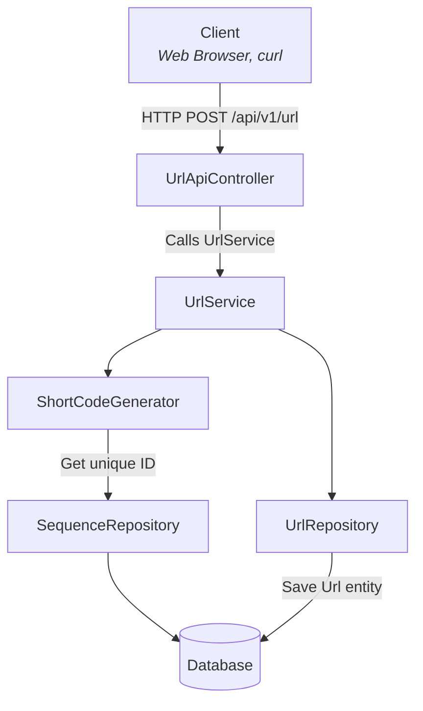
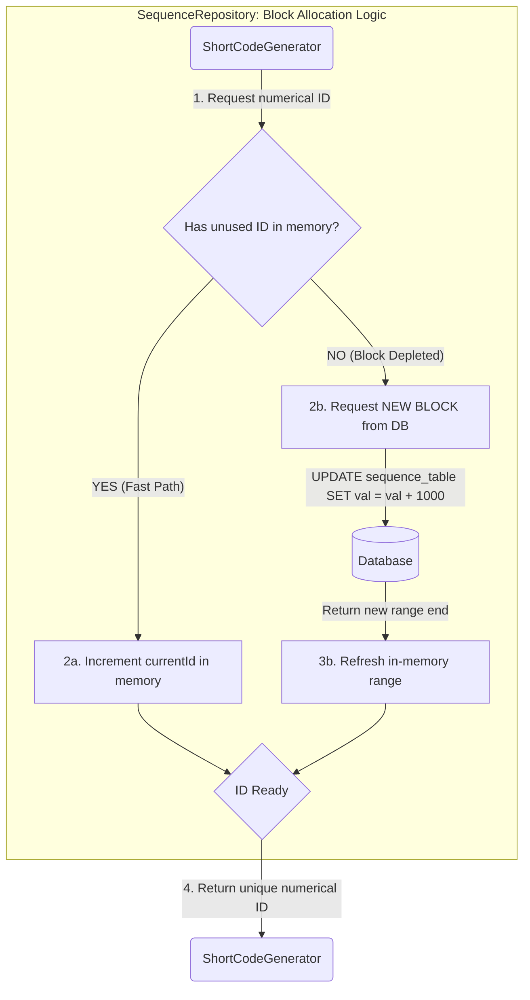
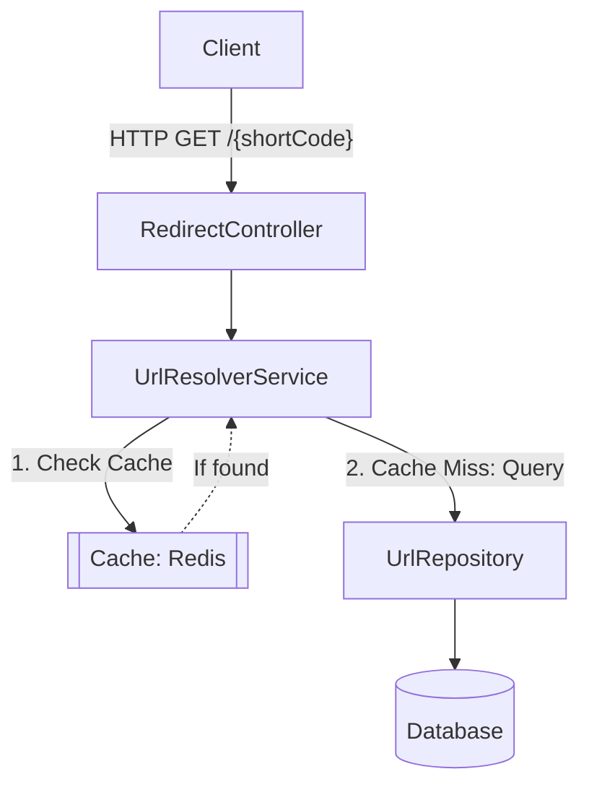

# TinyURL Service 🔗

> A minimal semi production-ready URL shortener designed for low-latency redirections and high scalability. 🚀

## 🚀 Quick start
Simply use `make run` and check if it is up and running from swagger ui.

### Swagger UI
The Swagger UI is available at `http://localhost:8080/swagger-ui/index.html` when the application is running.

## 🏗 Architecture Decisions

#### 1. Short Code Strategy (ID Shuffling)
Instead of random strings (which cause DB collisions) or sequential IDs (which are predictable and pose a security risk of enumeration), this service uses a robust approach:
1.  **DB Sequence:** A `global_id_sequence` table provides unique, sequential ID blocks for each instance of the app.
2.  **LCG Shuffling:** A Linear Congruential Generator shuffles the ID to make it non-obvious and non-predictable. This prevents enumeration of short URLs, enhancing privacy and security.
3.  **Base62 Encoding:** The shuffled ID is then efficiently encoded into a compact, URL-safe string for the final short URL (e.g., `https://tiny.url/aB3x9L`).

#### 2. High-Performance Caching (Redis)
To ensure rapid redirection and minimize database load, a read-through cache is implemented:
1.  **Read-Through Cache:** Redis is utilized to store the `Short Code -> Original URL` mapping.
2.  **Impact:** This dramatically reduces database hits for popular links, enabling sub-100ms redirection times and significantly improving overall service responsiveness and scalability.

#### 3. Optimized Database Access
Efficient database interactions are critical for performance:
1.  **Purpose-built Sequences:** Dedicated database sequences (e.g., `global_id_sequence`) ensure high-concurrency, collision-free ID generation.
2.  **Strategic Indexing:** Key columns, especially the `short_code` in the URL table, are indexed (`V2__add_index_on_short_url.sql`). This is crucial for sub-millisecond lookup times during redirection and other API calls, preventing full table scans.

#### 4. Scalable & Robust Cleanup
To prevent indefinite database growth and ensure resource efficiency, automated cleanup is integrated:
1.  **Scheduled Tasks:** A `UrlCleanupJob` runs periodically to prune expired or stale URL records from the database.
2.  **Distributed Locking (ShedLock):** `ShedLock` is used to ensure that this job runs reliably in a clustered environment, preventing multiple instances from executing the cleanup concurrently and ensuring data integrity.

#### 5. Comprehensive Quality Assurance
A strong emphasis is placed on code quality, reliability, and correctness:
1.  **Extensive Testing Suite:** The project includes a comprehensive suite of both unit tests (`...Test.kt`) and integration tests (`...IT.kt`).
2.  **Purpose:** This robust testing infrastructure ensures the correctness of business logic, validates API contracts, and provides confidence for future refactoring and feature development.

### ✨ Design Evolution & Trade-offs
Moving from a centralized bottleneck to a distributed range-based strategy, I solved for both **Network Latency** and **Availability**.

| **Feature**         | V1 (Direct DB)                | V2 (Redis Centric)               | **Current (Range-Based)**       | **Impact**                                          |
|:--------------------|:------------------------------|:---------------------------------|:--------------------------------|:----------------------------------------------------|
| **ID Generation**   | DB `AUTO_INCREMENT`           | Redis `INCR` (Centralized)       | **In-memory Blocks**            | 99.9% reduction in network round-trips.             |
| **Security**        | Sequential (1, 2, 3...)       | Sequential                       | **LCG Shuffled**                | Prevents business intelligence leaks                |
| **Fault Tolerance** | DB as Single point of failure | Redis as Single point of failure | **Local-First**                 | Service issues IDs even if DB/Redis are flickering. |
| **Scalability**     | High DB contention            | Single Redis Key bottleneck      | **Horizontally Scalable**       | Each instance acts independently.                   |
| **Reliability**     | No Error Schema               | No Error Schema                  | **Standardized Error Handling** | Predictable contract for Frontend/Client consumers. |

#### Why I moved away from Centralized Counters (Redis/DB):
In previous versions, every `shorten` request required a network hop to fetch the next ID. At scale, this introduces **latency spikes** and a **single point of failure**. By pre-allocating ID blocks to each instance, I achieved **O(1) local generation performance** while maintaining global uniqueness.

---

## 🧪 Development & Testing

| Command                       | Action                                                              |
|-------------------------------|---------------------------------------------------------------------|
| `make run`                    | Starts the application and its dependencies (`mysql` and `redis`).  |
| `make stop`                   | Stops the application and its dependencies.                         |
| `make test`                   | Runs the integration tests.                                         |
| `make build`                  | Builds the application JAR and a Docker image.                      |
| `make clean`                  | Cleans the build artifacts.                                         |
| `make format`                 | Formats the code using Ktlint.                                      |
| `make check`                  | Checks the code style using Ktlint.                                 |
| `make logs`                   | Tails the logs from the `mysql` and `redis` containers.             |
| `make health`                 | Checks the health of the application.                               |
| `make shorten url=<url here>` | Shortens a sample URL. If no URL is provided, it uses `https://example.com`. |

## URL Creation Flow

## Id generation flow to save db travels
#### this way every instance gets a block of id and does not need to call DB saving a lot of calls and time for us

## Short URL Redirection Flow

### ✨ Features & Limitations
##### Features
- ✅ Base62 Encoding: Short, URL-friendly codes.
- ✅ Expiration Support: Links automatically expire based on user input.
- ✅ Global Error Handling: Consistent JSON error responses.
- ✅ Flyway Migrations: Versioned database schema.
##### Roadmap
- 🚧 Custom aliases (e.g., /my-promo-link).
- 🚧 Rate limiting per IP.

### 🛠Tech Stack

### 📊 Analytics
The service tracks detailed click statistics for every shortened URL.

#### Features
- **Real-time Tracking:** Clicks are aggregated in real-time.
- **Granularity:** Supports both **Hourly** and **Daily** breakdowns.
- **Flexible Reporting:** Query stats for any custom date range.

#### API Endpoint
`GET /api/v1/urls/{shortCode}/stats`

| Parameter     | Description                                                                 | Default Value             |
|:--------------|:----------------------------------------------------------------------------|:--------------------------|
| `granularity` | Time bucket size: `HOUR` or `DAY`                                           | `DAY`                     |
| `from`        | Start date (ISO-8601). If omitted, defaults based on granularity.           | `NOW - 30 days` (Daily) `NOW - 24 hours` (Hourly) |
| `to`          | End date (ISO-8601).                                                        | `NOW`                     |

**Example Request:**
`GET /api/v1/urls/abc1234/stats?granularity=hour&from=2023-10-27T00:00:00Z`

#### 🛠 Development Data Seeding
When running in the `local` profile, the application automatically seeds the database with:
1.  **Sample URLs:** A set of predefined and random URLs.
2.  **Randomized Traffic:** Realistic click traffic distributed over the past 30 days for testing analytics visualization.

### Pre-requisites
- Java 21
- Gradle (or Gradle Wrapper)
- Docker (for running MySQL and Redis)
- make

