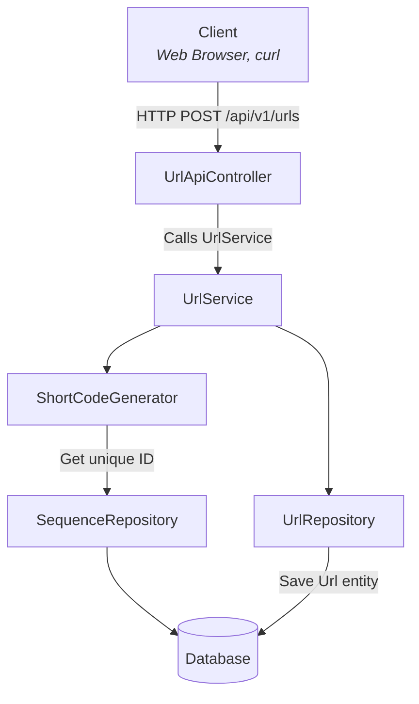
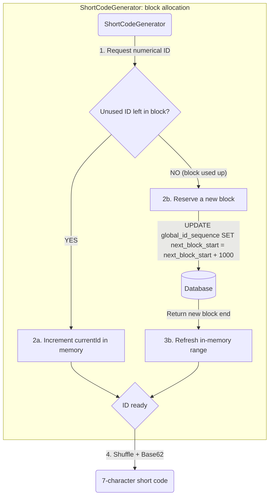
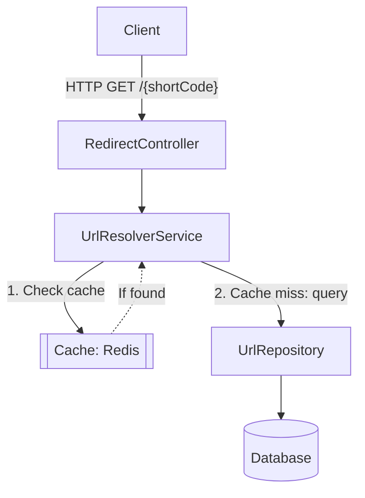
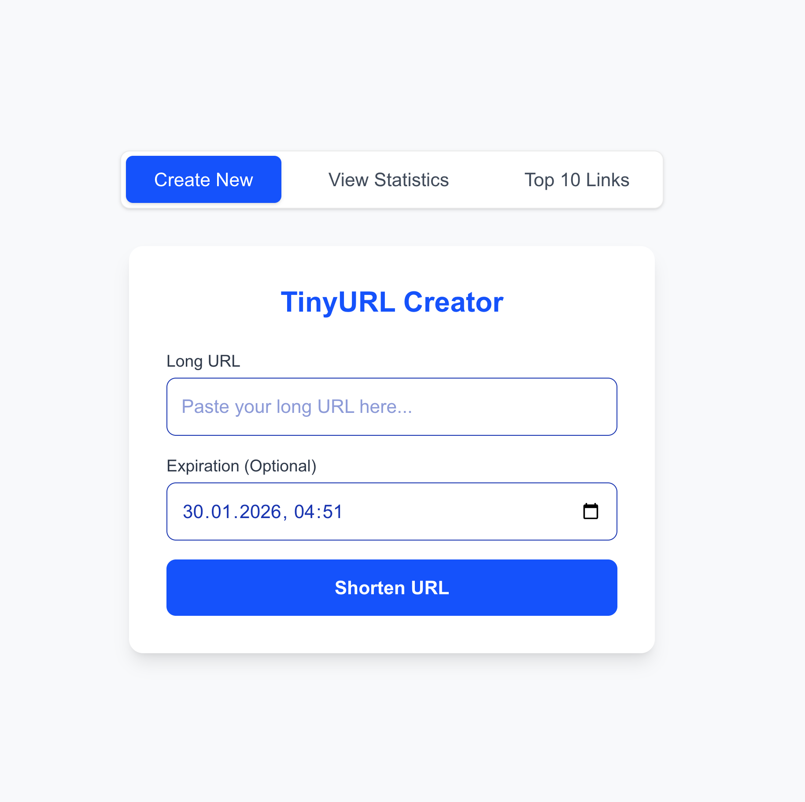
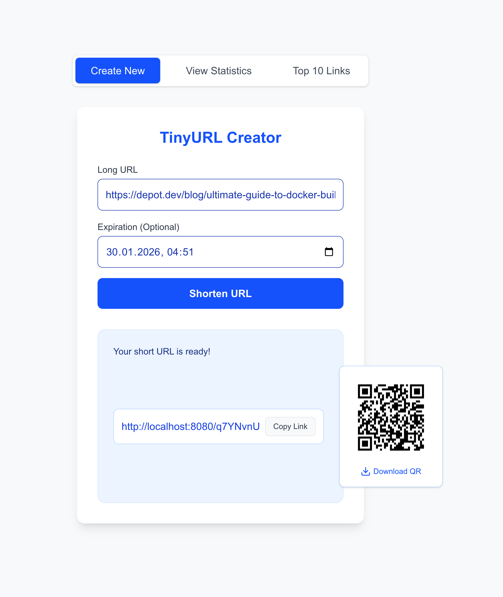
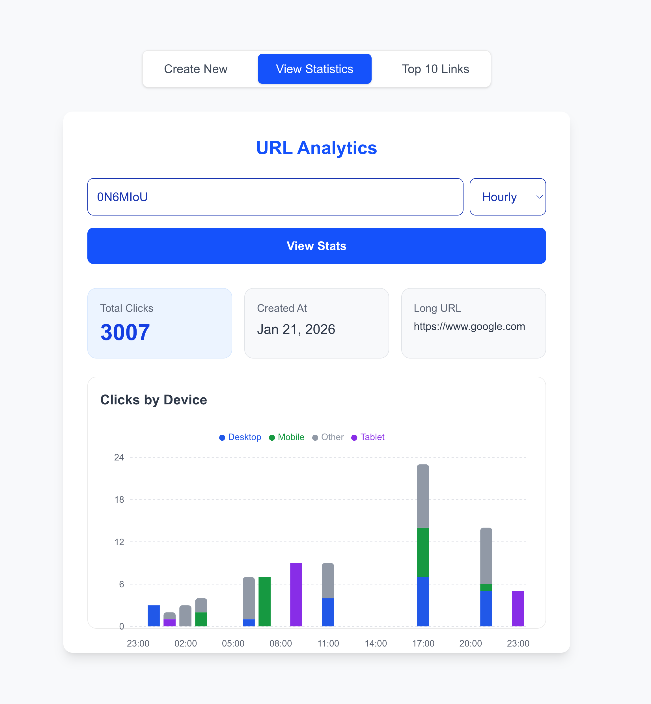
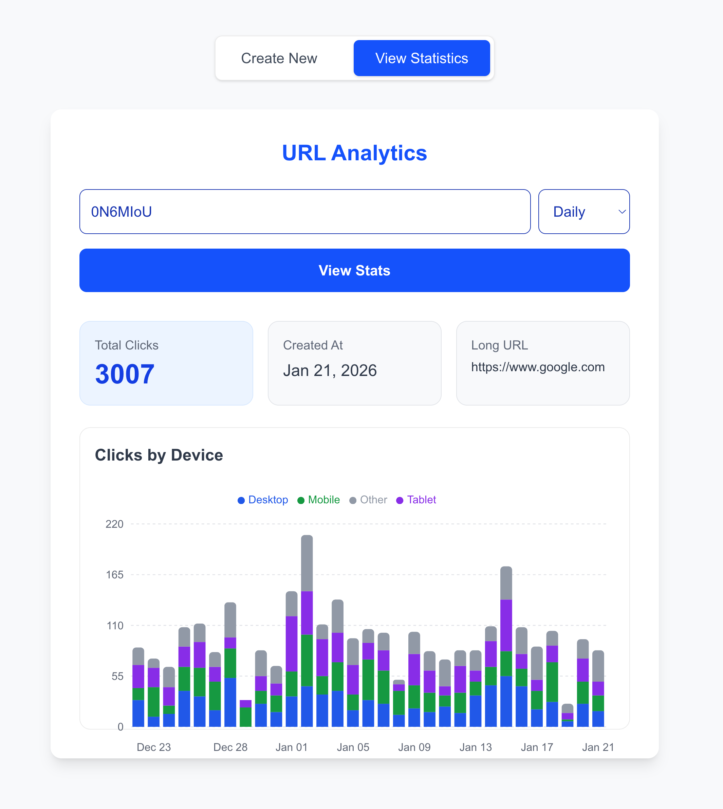
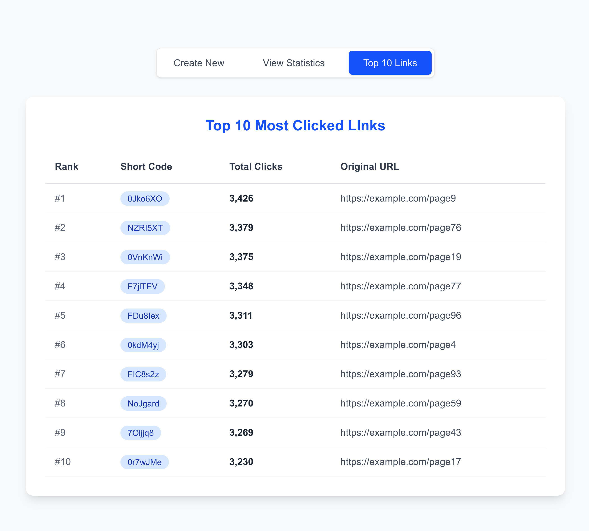
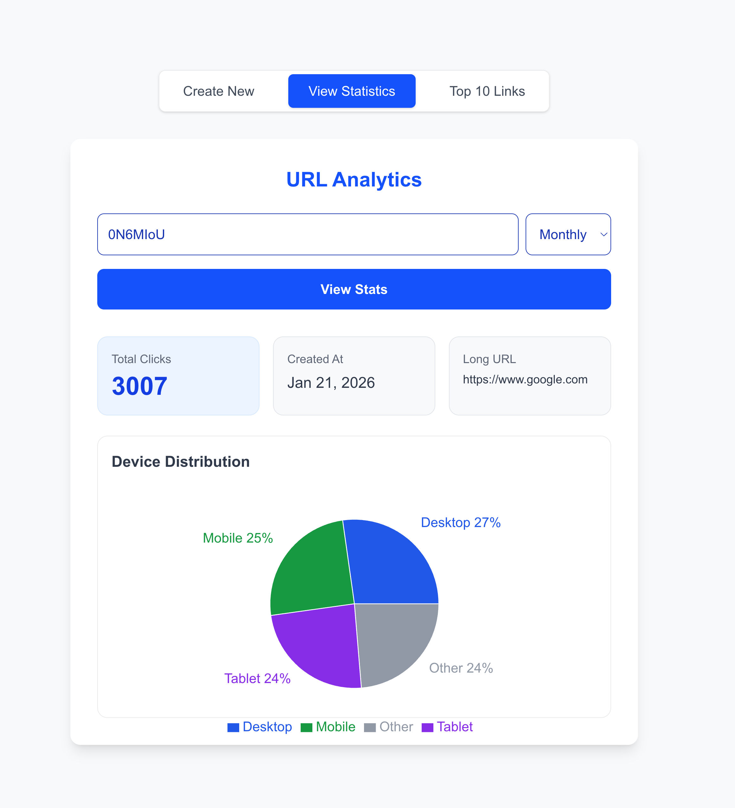

# TinyURL Service 🔗

> A URL shortener built as a learning project, to practise the decisions a backend has to make once it runs on more
> than one instance: ID generation, caching, scheduled jobs, schema migrations and testing.

It is not a production service and has not been load-tested. The sections below explain what I chose, what I
rejected, and what I know is still missing.

## Quick start

### Run with Docker (recommended)

Runs the whole stack (backend, frontend, MySQL, Redis) without installing Java or Node.js locally.

```bash
make run-docker
```

Or manually:

```bash
docker compose up -d --build
```

- **Frontend:** [http://localhost:3000](http://localhost:3000)
- **Swagger UI:** [http://localhost:8080/swagger-ui/index.html](http://localhost:8080/swagger-ui/index.html)

### Local development (requires Java 21 and Node.js)

`make run` starts MySQL and Redis in Docker and runs the backend with the `local` profile. Check that it is up in the
Swagger UI.

## The core question

Every new link needs an ID that is:

1. **Unique** across all running instances, without collisions to retry
2. **Short**: 7 URL-safe characters
3. **Not sequential**, so nobody can walk through other people's links by counting 1, 2, 3
4. **Cheap to create**, without a shared resource being hit on every request

Most of the design follows from this question.

## Design decisions

### 1. Short codes: reserved ID ranges + shuffle + Base62

1. **Reserve a range.** Each instance reserves a block of 1,000 IDs from a single-row `global_id_sequence` table with
   one atomic update (`UPDATE ... SET next_block_start = LAST_INSERT_ID(next_block_start + 1000)`), then hands IDs out
   from memory.
2. **Shuffle.** Each ID is mapped to a different number with
   `(id × 2,147,483,647 + 123,456,789) mod 10¹²`. Because 2³¹−1 is prime and shares no factor with 10¹², this map is a
   permutation: unique inputs stay unique, and neighbouring IDs land far apart.
3. **Encode.** The result is Base62-encoded with a scrambled alphabet. Since 62⁷ ≈ 3.5 × 10¹², every code fits in
   7 characters (e.g. `https://tiny.url/aB3x9Lq`).

**Options I considered:**

| Option                         | Unique       | Short          | Not sequential   | Cost per new link                  |
|:-------------------------------|:-------------|:---------------|:-----------------|:-----------------------------------|
| DB `AUTO_INCREMENT` (V1)       | yes          | yes            | no               | DB round trip on one counter       |
| Redis `INCR` (V2)              | yes          | yes            | no               | Redis round trip on one hot key    |
| Hash of the URL                | collisions   | only truncated | yes              | collision check and retry          |
| Random code + retry            | collisions   | yes            | yes              | retries grow as the space fills    |
| Snowflake-style 64-bit IDs     | yes          | no (11+ chars) | partly           | local, but needs clock and node id |
| **Reserved ranges + shuffle**  | **yes**      | **yes (7)**    | **yes**          | **one DB call per 1,000 links**    |

**What this costs:**

- **Gaps.** A restart discards the rest of the instance's block (up to 999 IDs). Acceptable with 10¹² IDs available.
- **Obfuscation, not security.** The shuffle is a linear formula; a few known codes are enough to reverse it. It hides
  volume and order, but it is not access control. Links that must stay secret would need random 128-bit tokens or
  signed URLs.
- **The database is still required.** Instances keep issuing IDs if MySQL is briefly unavailable, but saving the link
  still needs MySQL. The gain is less contention on a shared counter, not independence from the database.
- **MySQL-specific.** The `LAST_INSERT_ID` trick is MySQL syntax. On PostgreSQL a sequence with `INCREMENT BY 1000`
  would do the same job.

### 2. Redirects from a Redis cache

Redirects are read far more often than links are created, so the `short code → URL` mapping is cached in Redis
(read-through via Spring's `@Cacheable`). Most redirects never touch MySQL. Redirect latency has not been measured.

Expiry is checked on every resolve, also when the link comes from the cache, and the cleanup job clears the URL caches
after deleting expired links.

### 3. Cleanup runs on one instance only

A nightly `UrlCleanupJob` deletes expired links. ShedLock takes a lock in the database, using the database clock rather
than each server's clock, so only one instance runs the job.

### 4. Schema migrations with Flyway

The schema is versioned in `src/main/resources/db/migration` (V1 to V5). Flyway is the only tool that changes it;
Hibernate runs with `ddl-auto: validate`, so the app refuses to start if the entities and the migrations disagree.

### Why Redis and ShedLock at all?

They only pay off with several instances, which is the case I wanted to practise. A single instance would not need
them: an in-memory cache (e.g. Caffeine) and a plain `@Scheduled` job would be enough.

## How the design evolved

| | V1 | V2 | V3 (current) |
|:--|:--|:--|:--|
| **ID source** | DB `AUTO_INCREMENT` | Redis `INCR` | Block of 1,000 reserved from the DB, then counted in memory |
| **Shared calls for IDs** | One per new link | One per new link | One per 1,000 new links |
| **Codes** | Sequential | Sequential | Shuffled |
| **If the counter store is down** | No new links | No new links | IDs continue until the block runs out; saving still needs MySQL |
| **Errors** | Ad hoc | Ad hoc | One JSON error format for all failures |
| **Statistics** | None | None | Hourly and daily clicks per device type |

## Known limitations and next steps

Found while reviewing my own code. Listed here so the trade-offs are explicit.

| Limitation | Kind | Effect | Next step |
|:--|:--|:--|:--|
| `301` for links without expiry | Product decision | Browsers cache `301`, so repeat clicks are not counted and the target cannot change later. Expiring links already use `302` | Use `302` everywhere if analytics matter more than permanent links |
| Each click updates three rows (total, hourly, daily) | Scale trade-off | Popular links become hot rows under load | Count in Redis and write to MySQL in batches |
| The async executor queue is unbounded | Config | Click events pile up in memory under load | Bounded `ThreadPoolTaskExecutor` with a rejection policy |
| De-duplication is check-then-insert | Bug | Two concurrent requests for the same URL can hit the unique constraint | Handle the constraint violation and return the existing code |
| Integration tests need MySQL and Redis already running | Tooling | Tests depend on `docker compose` being up | Testcontainers |
| No load tests | Tooling | No performance numbers are claimed | Add a k6 or Gatling scenario before stating any |

Roadmap ideas: custom aliases (e.g. `/my-promo-link`), rate limiting per IP.

## Flows

### URL creation


```mermaid
graph TD
    Client[Client <br/><i>Web Browser, curl</i>] -- " HTTP POST /api/v1/urls " --> Controller[UrlApiController]
    Controller -- " Calls UrlService " --> Service[UrlService]
    Service --> SCG[ShortCodeGenerator]
    Service --> Repos[UrlRepository]
    SCG -- " Get unique ID " --> SeqRepo[SequenceRepository]
    SeqRepo --> DB[(Database)]
    Repos -- " Save Url entity " --> DB
```

### ID generation with reserved blocks

Each instance reserves a block of IDs and only calls the database again when the block is used up.


```mermaid
graph TD
    subgraph "ShortCodeGenerator: block allocation"
        direction TB
        B(ShortCodeGenerator) -- " 1. Request numerical ID " --> C{Unused ID left in block?}
        C -- " YES " --> D["2a. Increment currentId in memory"]
        D --> E{ID ready}
        C -- " NO (block used up) " --> F["2b. Reserve a new block"]
        F -- " UPDATE global_id_sequence SET next_block_start = next_block_start + 1000 " --> G[(Database)]
        G -- " Return new block end " --> H["3b. Refresh in-memory range"]
        H --> E
    end

    E -- " 4. Shuffle + Base62 " --> I(7-character short code)
```

### Redirection


```mermaid
graph TD
    ClientR[Client] -- " HTTP GET /{shortCode} " --> RedirCtrl[RedirectController]
    RedirCtrl --> Resolv[UrlResolverService]
    Resolv -- " 1. Check cache " --> Cache[[Cache: Redis]]
    Resolv -- " 2. Cache miss: query " --> RepoR[UrlRepository]
    RepoR --> DBR[(Database)]
    Cache -.->|If found| Resolv
```

## Analytics

Clicks are counted per link, per hour and per day, split by device type (parsed from the User-Agent). Only aggregated
counts are stored: no IP addresses and no raw User-Agent strings.

`GET /api/v1/urls/{shortCode}/stats`

| Parameter     | Description                                                       | Default value                                        |
|:--------------|:------------------------------------------------------------------|:-----------------------------------------------------|
| `granularity` | Time bucket size: `HOUR` or `DAY`                                 | `DAY`                                                |
| `from`        | Start date (ISO-8601). If omitted, defaults based on granularity. | `NOW - 30 days` (daily)<br>`NOW - 24 hours` (hourly) |
| `to`          | End date (ISO-8601).                                              | `NOW`                                                |

**Example request:**
`GET /api/v1/urls/abc1234/stats?granularity=hour&from=2023-10-27T00:00:00Z`

`GET /api/v1/urls/stats/top` returns the 10 most-clicked links.

## Development and testing

| Command                       | Action                                                                                  |
|-------------------------------|-----------------------------------------------------------------------------------------|
| `make run-docker`             | Starts the entire stack (backend, frontend, DB, Redis) in containers, `local` profile.  |
| `docker compose up --build`   | Starts the entire stack in containers (manual command).                                 |
| `make run-backend`            | Starts MySQL and Redis in Docker, then the backend.                                     |
| `make run-frontend`           | Starts the Next.js frontend.                                                            |
| `make run-all`                | Starts backend and frontend together.                                                   |
| `make stop`                   | Stops the application and its dependencies.                                             |
| `make test`                   | Runs unit and integration tests. Integration tests need MySQL (port 3106) and Redis running, e.g. via `docker compose up -d mysql redis`. |
| `make build`                  | Builds the application JAR and a Docker image.                                          |
| `make clean`                  | Cleans the build artifacts.                                                             |
| `make format`                 | Formats the code with Ktlint.                                                           |
| `make check`                  | Checks the code style with Ktlint.                                                      |
| `make logs`                   | Tails the logs of the `mysql` and `redis` containers.                                   |
| `make health`                 | Checks the health of the application.                                                   |
| `make shorten url=<url here>` | Shortens a URL. Without `url`, it uses `https://example.com`.                           |

Tests: unit tests (`...Test.kt`) cover the shuffle, the code generator and the service logic; integration tests
(`...IT.kt`) cover the controllers, services and repository against real MySQL and Redis.

### Development data seeding

With the `local` profile, the application seeds the database with sample URLs and randomized click traffic over the
past 30 days, to make the analytics views useful.

### Prerequisites

- Java 21
- Gradle (or the Gradle wrapper)
- Docker (for MySQL and Redis)
- make
- npm (for the frontend)

## Tech stack


## Frontend UI

A small Next.js frontend to shorten links and view statistics.

1. Go to the UI directory:
   ```bash
   cd tiny-ui
   ```
2. Install dependencies:
   ```bash
   npm install
   ```
3. Run the development server:
   ```bash
   npm run dev
   ```
4. Open [http://localhost:3000](http://localhost:3000).

   > **Tip:** on a freshly seeded database, these short codes have analytics data:
   > - `0N6MIoU`
   > - `02V71pQ`
   > - `09CoWdf`
   > - `0LEMExa`

### Screenshots

|                    **Dashboard**                     |             **QR code and expiry**                 |
|:----------------------------------------------------:|:--------------------------------------------------:|
|      |  |
|       **Shorten URLs with an optional expiry**       |        **QR code generated on the client**         |

|           **Hourly details**           |           **Daily stats**            |
|:--------------------------------------:|:------------------------------------:|
|  |  |
|      **Hourly traffic per link**       |     **Daily clicks trend**           |

|       **Top links**                   | **Device distribution**                         |
|:-------------------------------------:|-------------------------------------------------|
|  |  |
|       **Most-clicked links**          | **Monthly breakdown by device type**            |

[](LICENSE)
